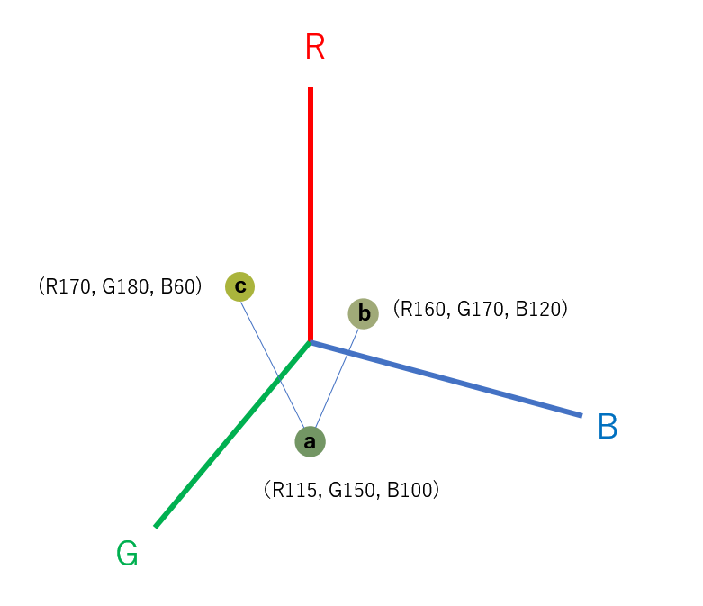

# Colorme

#### _このアプリケーションはコードクリサリス在学中に作成されました。_ <br><br>

「この色はなんという名前だったろう。  
赤とか、青とか、ではなく、もっと細やかな名前があったはず。」

色の名前は単なる記号ではなく、それ自体、繊細で色彩にあふれています。
わずかな違いを表す名前を、もう一度味わうためにこのアプリを作りました。

ふと、この写真の色はなんというのだろう、と思ったとき、懐かしい響きの名前が調べられます。

---

## ローカルでのインストール

### バックエンド

python がインストールされている前提で、[バックエンドレポジトリ](https://github.com/miomaeshima/Colorme-backend)をクローンしたのち、コマンドラインで以下のように入力。

```
$ pip install flask flask_cors openpyxl
$ virtualenv
$ env\Scrips\activate
$ python app.py
```

### フロントエンド

[フロントエンドレポジトリ](https://github.com/miomaeshima/Colorme-frontend)をクローンしたら、コマンドラインで以下の通り入力。

```
$ npm install または　yarn
$ npm http-server または yarn http-server
```

http://localhost:8080 を開いてください。

---

## 使い方　　

今はイメージファイルにある画像のみが対象です。

アプリには 712 色を含む日本の伝統色パレットが入っおり、それぞれの色には RGB 値と伝統的色名が含まれています。

<p align="center"></p>

例えば上の画像をクリックすると、この画像中、一番使われている色がパレットから探され、同じ色か、まったく同じ RGB 値の色がない場合はその色に一番近い色が求められて、その伝統的名称が、色彩とともに表示されます。

<p align="center"></p>

色の近さは RGB を 3 次元の座標ととらえ、写真のメインカラーとパレット中の色の距離を見て、この距離が一番近い色を表示します。

<p align="center"></p>

写真のメインカラーを a としたとき、色 c より、色 b のほうが近い。

---

## テクノロジー

フロントエンド　 HTML, CSS, HTML, CSS, JavaScript, [color-thief](https://github.com/lokesh/color-thief)  
バックエンド　 Python

---

## 今後の機能拡張

1．デモページの作成。  
2．デバイス内の画像ファイルを選択できるようにする。  
3．画像をアップロードして色名を調べられるにする。  
4．英語の色名パレットにも切り替えられるようにする。  
5．背景色によって文字の色を変える。
